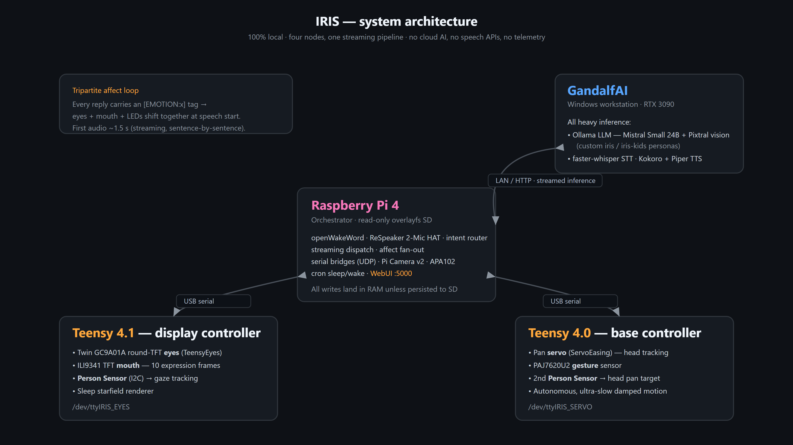

# IRIS — a personality-first AI robot face


**Most home assistants are a microphone with a personality bolted on. IRIS is the other way around.** It's a physical robot face — gaze-tracking eyes that follow you across the room, a mouth and LEDs that shift with its mood, a voice that trades quips with adults and plays "guess my face" with kids — and it runs **100% on hardware you own, with zero cloud AI, zero speech APIs, and zero telemetry.**



IRIS is a personality-first AI robot. The core design goal is genuine character, emotional congruence, and a face that means what it says — voice, eyes, mouth, and LED lighting all changing simultaneously, in real time, based on conversational content. All technical architecture serves this goal.

IRIS borrows from interpersonal neurobiology — the science of how people attune to each other through affective attunement, paraverbal signal, timing, and congruent affect — and treats it as an engineering spec rather than a metaphor. The aim is the uncanny-in-a-good-way feeling of being talked *to*, not at: a robot with enough character to trade quips with an adult and play I Spy or "guess my face" with a kid. The personality is defined by what IRIS *is*, not by what it must avoid — which keeps the model's anthropomorphic expression wide open.

After 168 documented build sessions, everything runs locally on owned hardware: zero cloud AI dependencies, zero external speech APIs, zero telemetry.

### Signature integrations

- **Lifelike gaze-tracking eyes** — the namesake feature: a high-detail TeensyEyes render (Adafruit Uncanny Eyes lineage) on twin 240×240 round displays, with a Useful Sensors Person Sensor literally driving the gaze so IRIS's eyes follow you around the room. Pupils dilate and the eye style shifts with emotion. A second Person Sensor pans the whole head to track you — deliberately, glacially slow.
- **Camera vision & recognition** — a Raspberry Pi Camera Module v2 feeds a vision-capable LLM (Mistral Small with Pixtral vision baked in). IRIS plays reciprocal I Spy / Show Me / Make a Face — seeing, reacting in character, and keeping the back-and-forth going for several turns without re-waking — and recognizes specific people, and the family dog, by name from descriptions written into its persona modelfile.
- **RPQR instant-quip wake** — a pre-synthesized quip fires the moment you say the wake word, before the inference server has even received the request, so there is zero perceived wake lag.
- **Streaming-first speech** — IRIS starts talking on the first sentence while the rest still generates: ~1.5 s to first audio instead of waiting ~23 s for a full reply.
- **Tripartite affect loop** — every reply carries an `[EMOTION:x]` tag that drives eyes, mouth, and LEDs in one simultaneous signal.

## Architecture

Four nodes, one pipeline:

| Node | Role |
|---|---|
| **Raspberry Pi 4** (overlayfs, read-only SD) | Orchestrator: wakeword, ReSpeaker 2-Mic HAT audio (GPIO ribbon), intent routing, streaming dispatch, LEDs, Raspberry Pi Camera Module v2, Teensy serial bridge, WebUI (port 5000), cron sleep/wake |
| **GandalfAI** (Windows workstation, RTX 3090) | All heavy inference: Ollama LLM (Mistral Small 24B, Pixtral vision baked in, behind custom `iris` / `iris-kids` persona modelfiles), faster-whisper STT, Kokoro TTS (primary) + Piper TTS (fallback) |
| **Teensy 4.1** (USB serial) | Display controller: two GC9A01A round-TFT eyes + ILI9341 TFT mouth (10 expression frames), Person Sensor on I2C for gaze tracking, sleep starfield renderer |
| **Teensy 4.0** (USB serial) | Base controller: pan servo (ServoEasing) + PAJ7620U2 gesture sensor, second Person Sensor for head tracking |

The pipeline: openWakeWord hears "Hey IRIS" on-device → silence-gated recording → Whisper transcription → an intent router short-circuits non-LLM commands (volume, sleep, stop) → the LLM streams → each completed sentence is synthesized and played while later sentences are still generating. **First audio lands in ~1.5 seconds**; a `STOP` halts everything within one sentence boundary. Every turn's emotion tag is fanned out to eyes, mouth, and LEDs at speech start.

Two infrastructure decisions do a lot of quiet work: the Pi runs an overlay filesystem where all writes land in RAM unless explicitly persisted to SD (instant rollback: reboot), and the Teensy boards are addressed by udev symlinks bound to hardware serial numbers (`/dev/ttyIRIS_EYES`, `/dev/ttyIRIS_SERVO`) so cable moves never break the system. A single bridge process owns each serial port; everything else talks to it over local UDP.

## The wake word: a small, honest ML war story

IRIS answers to a fully custom wake phrase, "Hey IRIS," detected on-device by [openWakeWord](https://github.com/dscripka/openWakeWord) — no cloud speech API, no Alexa/Google wake engine. Getting a custom wake word to a reliable, low-false-positive state is a full small-scale machine-learning training run, not a config value:

- Trained via [atlas-voice-training](https://github.com/briankelley/atlas-voice-training), a Docker-packaged fork of the openWakeWord training pipeline.
- **50,000 synthetic positives** of "hey iris" generated by Piper TTS, against **~2,000 hours** of general-audio negatives (ACAV100M features), MUSAN music, and room-impulse-response reverb augmentation.
- 100,000 training steps, DNN head on the frozen Google embedding model, on an RTX 3090 — 6–8 wall-clock hours, roughly **2.5 kWh**. That's ~25 full MacBook Pro charges for one "yes, it heard me."
- Measured result at threshold 0.50: 67% recall, 0.5 false-positives/hour. The live threshold was later raised to 0.70 after real household false-wakes — a lived-in-the-room decision, not a lab metric.
- It doesn't end at "trained." An earlier attempt reportedly scored far better (97% recall, 0 FP) but was lost to a threshold misconfiguration — the only copy was the deployed artifact, not a reproducible recipe. A later attempt to broaden the training data made false positives 4× *worse*. Every retrain is genuinely a fresh experiment.

The full story, including the retraining plan for under-served children's voices, is in [docs/wakeword_training_story.md](docs/wakeword_training_story.md).

## Operate, Diagnose, Tune

The design thesis of the IRIS WebUI: **the system must be diagnosable and tunable by any operator — human or AI agent — from its own UI and logs, without reading source code.** Every latency stage is measured and charted, every sensor has a liveness check, every behavior knob is a live-applied config value rather than a code constant, and destructive paths have an undo. None of this is IRIS-specific; these are patterns worth stealing for any hardware/AI project.

The WebUI ([pi4/iris_web.html](pi4/iris_web.html) + [iris_web.js](pi4/iris_web.js), served by [iris_web.py](pi4/iris_web.py)) has fifteen tabs:

1. **Audio** — recording capture tuning: max record seconds, silence timeout, and silence RMS gate, with a *separate* set of the same three knobs for Kids Mode (children pause longer and speak quieter; one set of gates can't serve both).
2. **Wake Word** — the openWakeWord confidence threshold and the post-wake drain window (audio flushed after the wakeword before recording starts — lower is snappier, higher bleeds less wakeword into the transcript). Shows which model file is live.
3. **Voice** — Kokoro TTS control: enable/disable, voice selection populated live from the Kokoro server (including weighted multi-voice blends), and speech rate. Piper is the zero-config offline fallback.
4. **Conversation** — the conversational-feel knobs: follow-up timeouts (adult and kids), max follow-up turns, context expiry, and the four response-length token tiers (SHORT/MEDIUM/LONG/MAX) that IRIS picks between automatically per question, plus the TTS character cap. Changes apply on the next turn, no restart.
5. **Eyes** — eye type and emotion rendering controls: seven selectable rendered eye styles (Nordic Blue, Flame, Hypno Red, Hazel, Blue Flame, Dragon, Striking Blue), the startup default, an Emotion Test grid that fires any of nine emotions at the face, a per-emotion **Emotion Display Mapping** table (which eye style and which of ten TFT mouth frames each emotion shows), and idle-animation start/stop (breathe/blink/twitch/boing).
6. **Sleep** — sleep/wake control and state indicator with the cron auto-schedule, plus the nighttime rendering stack: a tunable cosmic-starfield dream scene on eyes and mouth (star density, warp events, shooting stars, a drifting moon and Saturn, mouth waveform and ZZZ), the indigo APA102 sleep-breathe LEDs, and the three-tier TFT mouth brightness ladder (awake / idle / sleep, 0–15 PWM).
7. **Lights** — the APA102 LED breathe states for waking life: idle (cyan) and kids mode (yellow), each with peak/floor brightness and cycle period.
8. **Gandalf AI** — which Ollama model serves the adult persona and which serves kids mode, plus a live VRAM view of what's actually loaded on the inference server.
9. **Logs** — the structured pipeline event log with live tail (auto-refresh) and one-click category filters: wakeword, heard, route, LLM, spoken, STOP-gate events, persona **DRIFT** detections, errors, gestures. False wakewords are visible at a glance as a WAKE with no following HEARD. Results of the startup POST self-test (current authorized baseline: 20/23 PASS, 0 FAIL) surface here.
10. **System** — service status and restart, the disk-first Resource Monitor (overlay/SD/journal usage with a 60-minute journal sparkline — built after a silent log-growth incident so a space runout can't recur unnoticed), the on-demand 5-layer POST diagnostic (hardware presence → network services → display exercise → pipeline smoke → config integrity), config persist-to-SD, and speaker volume with a hard ceiling.
11. **Chat** — talk to IRIS by text: silent text mode, LLM + speak, or **speak verbatim** (puppet the voice directly, no LLM), against either persona. Also hosts the Vision Demo: capture a Pi-camera frame and interrogate the vision model with preset or custom prompts.
12. **Bench** — the turn-latency sparkline (last 20 turns, wakeword → first speaker output, from `iris_bench.jsonl`) over a full per-stage timing table: recording, transcription, first LLM chunk, full stream, TTS synth, playback, to-first-word, end-to-end, and token counts per turn — plus a read-only snapshot of the active tuning levers. When IRIS feels slow, this tab says exactly which stage to blame.
13. **Gestures** — the customizable PAJ7620U2 gesture-to-action mapping on the second Teensy 4.0 (the same board that drives the pan servo): eight gestures (four swipes, push/pull, wrist CW/CCW) each mapped to an action from a dropdown, applied immediately. A live per-direction activity monitor separates "the sensor never saw that swipe" from "the mapping is wrong" — the difference between a hardware problem and a config problem, on screen.
14. **Vision Cal** — runtime tuning of the eye-tracking sensors with **no firmware rebuild**: live `PS_CFG` values (confidence gate, timing) are sent to the Teensy 4.1 over serial and re-applied from `ps_config.json` on every restart; a Person Sensor health card decodes I2C probe results and face events into ALIVE/ABSENT; and per-sensor indicator-LED toggles give a one-click liveness proof (the LED lights only if the I2C write lands).
15. **Soundboard** — data-driven editing of every canned thing IRIS says: pre-LLM audio clips (trigger keywords + emotion gates per clip, enable/disable, preview, upload) and all quip categories (wake quips by time band, double-tap and post-speech reactions, kids fillers, gesture cues, top-of-hour lines). Saves write one JSON source of truth and apply **live** — clips reload instantly and edited quips re-synthesize in-process, no restart — with a goldbak **Undo last save** and a reset-to-defaults escape hatch.

## Persona fidelity testing

A personality robot has a failure mode ordinary assistants don't: sounding like a chatbot. IRIS treats that as a testable regression.

- [tools/persona_harness/](tools/persona_harness/) — a multi-turn drift harness that runs scripted conversations (including deliberate "you're just an AI, admit it" boilerplate traps) against the live Ollama persona models, reusing the *production* emotion-extraction, reply-cleaning, and intent-routing code so what's scored is what would be spoken. Every turn is flagged for `markdown_leak`, `followup_boilerplate`, `rlhf_boilerplate`, and `persona_drift`, rolled up into a CLEAN/LOW/MEDIUM/HIGH drift verdict with JSON + text reports (and optional per-turn TTS audio for listening checks):

  ```
  python tools/persona_harness/run_harness.py --model iris [--tts]
  ```

- [pi4/iris_bench_report.py](pi4/iris_bench_report.py) — pipe the assistant journal through it to get a per-stage latency table (recording / STT / first-chunk / stream / TTS / playback / total) for every recent turn.
- [scripts/iris_status.ps1](scripts/iris_status.ps1) — writes a machine-readable `IRIS_STATUS.json` (git state, last firmware build, live service state on the Pi) built specifically so an AI agent can load ground truth at session start instead of parsing prose.

## Building it yourself: what's here and what isn't

This repo is the **reference implementation** — real, running source, not a demo stub — but it is not a turnkey installer. Be clear-eyed about what ships and what you'd need to supply.

**Firmware (buildable as-is with [PlatformIO](https://platformio.org/)):**

```bash
pio run -e eyes                                                # Teensy 4.1 — eyes + mouth (root platformio.ini)
cd servo_teensy40/teensy40_base_mount && pio run -e teensy40   # Teensy 4.0 — servo + gesture sensor
```

Both trees compile clean as shipped — verified with PlatformIO 6.1.19 (Teensy 4.1 and 4.0 platform toolchains, both `[SUCCESS]`). The `[env:eyes]` build depends on one required pre-build hook, [scripts/patch_gc9a01a.py](scripts/patch_gc9a01a.py): the root `platformio.ini` names it as an `extra_scripts = pre:` entry, so a clone that's missing the file aborts before compilation even starts (this file was the one build-breaking gap in the first public export). When present, PlatformIO runs it before each build to patch the fetched `GC9A01A1_t3n` display library, whose 6-argument `drawChar` wrapper otherwise calls itself — infinite recursion at runtime — instead of forwarding to its 7-argument overload.

**Pi4 orchestrator (`pi4/`) — source ships, deployment scaffolding does not:**

`pi4/` is the actual production Python — `assistant.py`, `services/`, `core/`, `hardware/`, the WebUI — read this for the real architecture and pipeline logic. What's *not* included, because it doesn't exist as a generic artifact in the private repo either:

- **No systemd unit files for the core services.** Live IRIS runs `assistant.service` and `iris-web.service`, but those are hand-authored on the deployed Pi, not tracked as portable templates in the repo. (The one `.service` file that does ship, [pi4/scripts/ogle-bridge.service](pi4/scripts/ogle-bridge.service), belongs to a retired, out-of-scope face-tracking node — not a template for the core pipeline.)
- **No `iris_config.json`.** Runtime config (LED brightness, TTS voice, sensor thresholds, etc.) is authored fresh per-deployment; there's no shipped default to copy.
- **[pi4/requirements.txt](pi4/requirements.txt)** — provided, but *inferred mechanically* from the actual `import` statements in `pi4/**/*.py` (AST-parsed, third-party only), not hand-verified as a clean `pip install -r requirements.txt` on fresh hardware. Some of these (`RPi.GPIO`, `smbus2`, `spidev`) are more commonly installed via `apt` on Raspberry Pi OS than pip.

Treat the Pi4 side as **architecture to read and adapt to your own hardware**, not a one-command deploy.

## How it was built: the MAD loop

I built IRIS as the orchestrator of a fleet of AI agents, and the process is as much the point as the robot. Every significant change runs a Multi-Agent Development loop:

1. **Planning** (AI chat) — problem scoped, solution designed, risks identified. No code written.
2. **Adversarial critique** (a *different* AI) — independent review of the same plan; finds false assumptions and missed edge cases.
3. **Repo audit** (optional third agent) — cross-file impact and stale-reference sweep.
4. **Scope lock** — consolidated implementation scope with an explicit rollback plan.
5. **Execution** (AI coding agent) — file edits, deploys, live verification over SSH.
6. **Human validation** — I verify behavior on the physical robot. An AI cannot check whether the eyes actually track or the voice actually sounds right; those gates are not delegable.
7. **Session close** — changelog, machine-state snapshot, handoff notes, commit. The docs are the continuity layer that lets the next session's agent pick up cold.

The adversarial step has caught false hardware-state assumptions, serial-protocol ownership errors, and scope creep repeatedly across 168 sessions. Final authority always belongs to the human operator — the AIs plan, implement, and verify at the code level; I own physical reality. Deployed-file md5 hashes recorded at every close make "what is actually running right now" unambiguous across sessions and across agents.

## License & attribution

- Original IRIS code: **AGPL-3.0-or-later** (see [LICENSE](LICENSE)).
- The `src/eyes/` rendering engine is a derivative of [TeensyEyes](https://github.com/chrismiller/TeensyEyes) (Chris Miller), itself built on [Adafruit Uncanny Eyes](https://github.com/adafruit/Uncanny_Eyes) (Phil Burgess / Paint Your Dragon) and [GC9A01A_t3n](https://github.com/mjs513/GC9A01A_t3n) — those files remain **MIT-licensed** per the carve-out in LICENSE.
- **Media and 3D-printable files** (anything under docs/media/ and any STL/design files) are **CC BY-NC-SA 4.0**, not AGPL. The trained "Hey IRIS" wakeword model likewise inherits a **non-commercial (CC BY-NC-SA)** restriction from the ACAV100M-derived training data — do not use it commercially.
- Full third-party inventory with per-project license terms and links — Kokoro, faster-whisper, openWakeWord, atlas-voice-training, Ollama, Mistral Small 3.2, ServoEasing, seeed-voicecard, and the Thingiverse eye-housing reference — is in [docs/ATTRIBUTION.md](docs/ATTRIBUTION.md).
